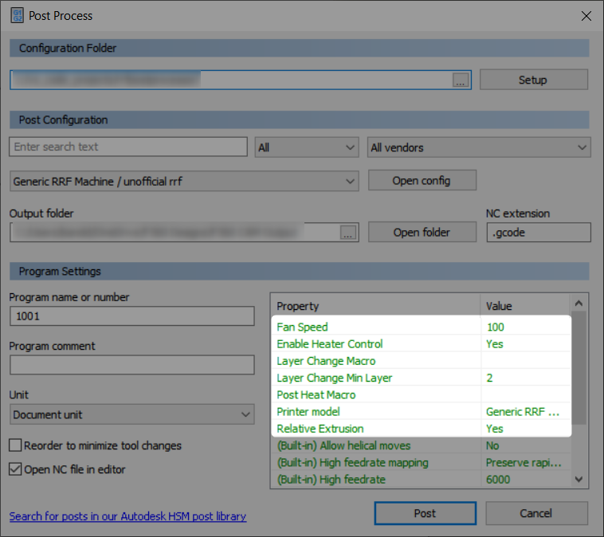

# First attempt at a RepRap Firmware post-processor for Fusion 360 FFF.

All previous start and end scripts stored in slicer should be moved to start.g and stop.g in RRF firmware.

## Usage

This is a stripped back post-processor with as few excess gcode commands as possible enabling full use of the RRF macro system. The post produces the bare minimum gcode to complete a print with all other requirements (for eaxample homing and heating) falling on start.g and stop.g

Several properties can be adjusted to customise the output. All are found in the properties table of the post-process window.

- **Enable heater Control:** When enabled, the output contains commands to heat the extruder and bed at the start and to turn them off at the end. Regardless of this setting, any heater related gcode commands given mid print will be included.
- **Layer Change Macro:** Full path to a macro that will be run at the start of each layer. Path is to be identical to that used in M98.
- **Layer Change Min Layer:** First layer at which the Layer Change Macro should be run.
- **Post Heat Macro:** Full path to a macro that will be run after the toolpath heater control but before the print start. Path is to be identical to that used in M98.

### Update 12/03/2020

Workaround for disabling generated toolpath control of extruder and bed heaters. Enable Heater Control (Default: Yes) decides whether the slicer should include commands to control initial warmup of the extruder and bed, followed by shut off at completion of the print. Enable for simplicity, disable if you want to use other methods (eg. the filament system) to control extruder and bed temps. The post-heat macro property remains but is not neccesary if heater control is disabled, in that case any methods that would otherwise go here can be moved to start.g.

Re-instated M0 H1 at end of print.

### Update 11/03/2020

Added post-processor properties
- Optional layer change macro property. Executes a macro at start of each layer. Insert full path to macro as per M98 in post-processing properties window. Useful for timelapses etc.
- Minimum layer to run layer change macro, default 2. Layer change macro will execute at the start of this layer and every layer thereafter.
- Optional post-heat macro property. Executes a macro after heating but before print start. Insert full path to macro as per M98 in post-processing properties window. Useful for additional wipe or purge routines

### Initial Release 11/03/2020

Early changes to generic fff example:
- Removed all pre-print homing, these should be added to start.g.
- Replace deprecated M107 with M106 S0.
- Replace deprecated M104 & M109 with G10 commands (untested for tool changes).
- Removed other functions start and end scripts.
- Append M0 to execute stop.g at end of job.

## In testing/ideas:
- ~~Optional execute macro after extruder and bed up to temperature (useful to home Z or run purge/wipe routines)~~ Done
- ~~Optional execute macro at layer change (for timelapses).~~ Done
- Standby temperature properties.

## Additional notes:
- Initial extruder heating, bed heating, and the purge line are all automatic and cannot be edited at present.
- Standby temperatures are not natively supported.
- CAM output for extrusion is absolute only.
- Heaters are turned off at end of toolpath. cannot be edited at present.
